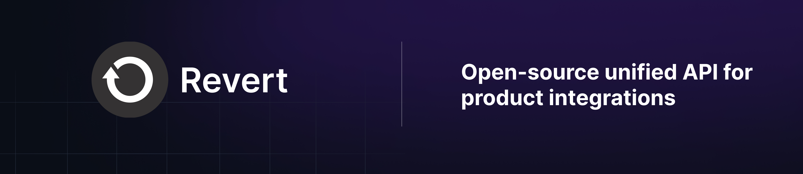

<p align="center">
<p align="center">


<center>

[Get started](https://revert.dev) · [Docs](https://docs.revert.dev/) · [Issues](https://github.com/revertinc/revert/issues) · [Discord](https://discord.gg/q5K5cRhymW) · [Get in touch](mailto:team@revert.dev)

</center>

[](https://github.com/revertinc/revert)
 [](https://discord.gg/q5K5cRhymW) [](https://twitter.com/intent/follow?screen_name=RevertdotDev) [](https://docs.revert.dev/) <a href="https://github.com/revertinc/revert/pulse"></a>
<a href="https://github.com/revertinc/revert/tree/main/LICENSE.txt" target="_blank">

</a>

</p>

### ⭐ About Revert

Revert makes it incredibly easy to build integrations with any third party API such as

-   Go-to-market tools like CRMs (Salesforce, Hubspot).
-   Communication tools (Slack, MS Teams)
-   Ticketing tools like (Jira, Asana)

> We believe an **open source unified API** enables us to cover the long tail of third party APIs while empowering engineers to customise the integration code we offer out of the box. This way engineers can use us over building everything from scratch.

### 📺 Demo

<a href="http://www.youtube.com/watch?feature=player_embedded&v=1aXXx66LKnY
" target="_blank">

<em>Revert Quick demo</em>
</a>

### Why Revert?

You might want to check us out if

-   You are developer building a B2B product
-   You have a ton of integrations on your roadmap
-   Your focus is building your core product vs maintaining integration code
-   You want to move fast and not break things

[Sign up](https://revert.dev) for an account or read our docs [here](https://docs.revert.dev) !

### 🚀 What makes us faster and reliable.

-   **Seamless Integration**: Revert has pre-configured apps on all these platforms so you don't have to create them and deal with nuances on each platform.
-   **Graceful Failure Handling**: Ensures smooth handling of expired permissions by customers, preventing any service disruptions.
-   **Automatic OAuth Token Refresh**: OAuth tokens are automatically refreshed, ensuring continuous API functionality.
-   **API Retry Mechanism**: Revert automatically retries failed API calls, improving reliability and minimizing potential issues.
-   **SDKs for Popular Frameworks**: Ready-to-use SDKs available for React, Vue, and Angular, enabling quick and easy integration.
-   **Self-Hosted**: Provides the flexibility to self-host the integration solution, giving you full control over deployment and data.

## 🗺️ Roadmap

CRMs:

-   [x] **Salesforce**
-   [x] **Hubspot**

-   [x] **Zoho CRM**

-   [x] **Pipedrive**
-   [ ] Other CRMs such as Close.io, Zendesk Sell, MS 365

Communication tools:

-   [ ] Slack
-   [ ] Microsoft Teams

Accounting software:

-   [ ] Xero
-   [ ] Quickbooks

...[and more](https://github.com/revertinc/revert/issues?q=is%3Aissue+is%3Aopen+label%3AIntegration)

-   [ ] Ability to self-host Revert inside your own cloud
-   [ ] SOC 2

Feel free to create an issue if you'd like an integration we're missing [here](https://github.com/revertinc/revert)

## Packages

This repo contains a set of packages under `@reverdotdev/` namespace such as:

-   [`@revertdotdev/backend`](./packages/backend): The core Revert API that powers the frontend SDKs.
-   [`@revertdotdev/revert-react`](./packages/react): Official SDK for React.
-   [`@revertdotdev/revert-vue`](./packages/vue): Official SDK for Vue.
-   [`@revertdotdev/js`](./packages/js): Official SDK for Javascript.
-   ...

## Quickstart

#### Spinning up Revert with docker-compose

The easiest way to start Revert is to run it via docker-compose:

```shell
# Get the code
git clone --depth 1 https://github.com/revertinc/revert

# Copy the example env file
cp .env.example .env

# Update this .env file with your own secrets

# Then In the root directory run
docker-compose up -d
```

The UI is now available at http://localhost:3000 and the backend is available at http://localhost:4001.

## Examples

The repo [`revert-example-apps`](https://github.com/revertinc/revert-example-apps) contains a set of examples how to use revert with different frameworks.

## 📞 Support

In case of questions/feedback, you can get in touch in the following ways

-   Open a Github support issue
-   Contact us at [email](mailto:team@revert.dev)
-   Ask a question in our [discord](https://discord.gg/q5K5cRhymW)
-   If you'd like you can book a call with our team below

<a href="https://cal.com/allenrevert/30min?utm_source=banner&utm_campaign=oss"></a>

## 🔒 Security

We take security seriously.

**Please do not file GitHub issues or post on our public forum for security vulnerabilities**.

Email `security@revert.dev` if you believe you have uncovered a vulnerability. In the message, try to provide a description of the issue and a way of reproducing it.

## 💪 Contributors

Thankful to the community for making Revert better every day ❤️

<a href="https://github.com/revertinc/revert/graphs/contributors">
  
</a>
