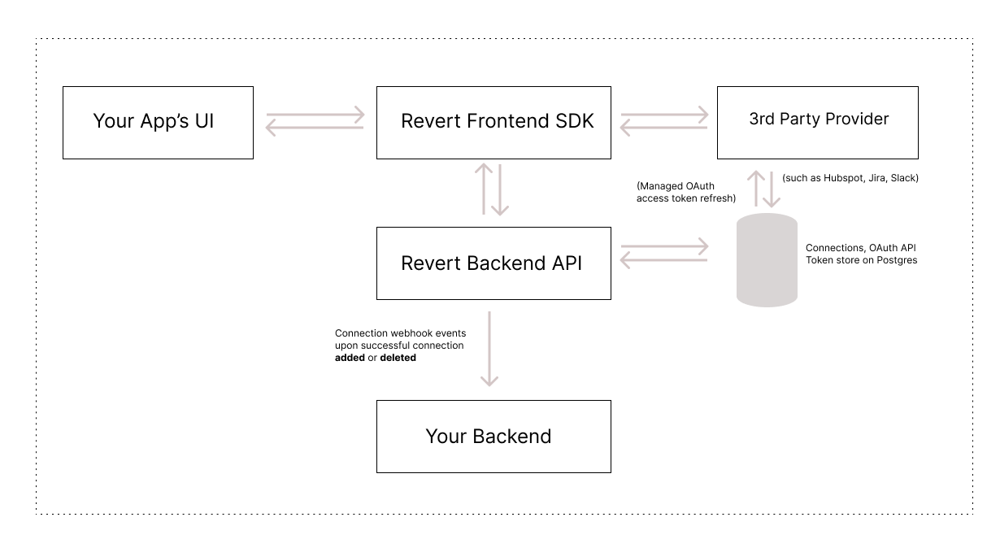

<p align="center">
<p align="center">


<center>

[iniciar](https://revert.dev) · [Documentos](https://docs.revert.dev/) · [Emitir](https://github.com/revertinc/revert/issues) · [Discord](https://discord.gg/q5K5cRhymW) · [Entrar em contato](mailto:team@revert.dev)

</center>

[](https://github.com/revertinc/revert)
 [](https://discord.gg/q5K5cRhymW) [](https://twitter.com/intent/follow?screen_name=RevertdotDev)  [](https://docs.revert.dev/) <a href="https://github.com/revertinc/revert/pulse"></a>
<a href="https://github.com/revertinc/revert/tree/main/LICENSE.txt" target="_blank">

</a>

</p>

#### Hacker News

<a href="https://news.ycombinator.com/item?id=37995761">
  
</a>
<a href="https://www.producthunt.com/posts/revert-3?utm_source=badge-top-post-topic-badge&utm_medium=badge&utm_souce=badge-revert&#0045;3" target="_blank"></a>
<a href="https://www.producthunt.com/posts/revert-3?utm_source=badge-top-post-badge&utm_medium=badge&utm_souce=badge-revert&#0045;3" target="_blank"></a>

### ⭐ Sobre Revert

Revert torna incrivelmente fácil criar integrações com qualquer API de terceiros, como

-   Ferramentas de entrada no mercado como CRMs (Salesforce, Hubspot).
-   Ferramentas de comunicação (Slack, MS Teams)
-   Ferramentas de emissão de ingressos como (Jira, Asana)

> Acreditamos que uma **API unificada de código aberto** nos permite cobrir a longa lista de APIs de terceiros, ao mesmo tempo que capacita os engenheiros a personalizar o código de integração que oferecemos imediatamente. Dessa forma, os engenheiros podem nos usar para construir tudo do zero.

### Por que Revert?

Você pode querer nos verificar se

-   Você é um desenvolvedor que está construindo um produto B2B
-   Você tem muitas integrações em seu roteiro
-   Seu foco é construir seu produto principal em vez de manter o código de integração
-   Você quer se mover rápido e não quebrar as coisas

[Inscreva-se](https://revert.dev) para uma conta ou leia nossos documentos [aqui](https://docs.revert.dev) !

### 🚀 O que nos torna mais rápidos e confiáveis.

-   **Integração Perfeita**: Revert possui aplicativos pré-configurados em todas essas plataformas para que você não precise criá-los e lidar com nuances em cada plataforma.
-   **Tratamento elegante de falhas**: garante o tratamento tranquilo de permissões expiradas pelos clientes, evitando interrupções de serviço.
-   **Atualização automática de token OAuth**: os tokens OAuth são atualizados automaticamente, garantindo a funcionalidade contínua da API.
-   **Mecanismo de nova tentativa de API**: a reversão tenta automaticamente novas chamadas de API com falha, melhorando a confiabilidade e minimizando possíveis problemas.
-   **SDKs para estruturas populares**: SDKs prontos para uso disponíveis para React, Vue e Angular, permitindo integração rápida e fácil.
-   **Auto-hospedado**: oferece flexibilidade para auto-hospedar a solução de integração, proporcionando controle total sobre a implantação e os dados.

## Começo rápido

#### Revert Cloud

A maneira mais fácil de começar é criar uma [conta Revert Cloud](https://app.revert.dev/sign-up). A versão em nuvem oferece a mesma funcionalidade da versão auto-hospedada.

Porém, se você deseja auto-hospedar o Revert, você pode fazer isso hoje com docker-compose conforme as instruções abaixo.

#### Ativando a Revert com docker-compose

A maneira mais fácil de começar com o Revert auto-hospedado é executá-lo via docker-compose:

```shell
# Get the code
git clone --depth 1 https://github.com/revertinc/revert

# Copy the example env file
cd revert
cp .env.example .env
cp packages/backend/.env.example packages/backend/.env
cp packages/client/.env.example packages/client/.env
cp packages/js/.env.example packages/js/.env
cp packages/react/.env.example packages/react/.env
cp packages/vue/.env.example packages/vue/.env

# Ensure that clerk is setup in `client` and a user is created by following the instructions here: https://docs.revert.dev/overview/developer-guide/developer-guide#-revertdotdev-client

# Update these .env files with any of your own secrets if you'd like to.

# Then In the root directory run

# When running for the first time to seed the database. (RUN ONLY ONCE)
docker-compose run db-seed

# For subsequent runs
docker-compose up -d

```

A UI agora está disponível em http://localhost:3000 e o backend está disponível em http://localhost:4001.

## Arquitetura

### Fluxo de conexão para os usuários do seu aplicativo com Revert



### Visão geral da arquitetura


## Pacotes

Este repositório contém um conjunto de pacotes no namespace `@reverdotdev/`, como:

-   [`@revertdotdev/backend`](./packages/backend): A API Revert principal que alimenta os SDKs de front-end.
-   [`@revertdotdev/revert-react`](./packages/react): SDK oficial para React.
-   [`@revertdotdev/revert-vue`](./packages/vue): SDK oficial para Vue.
-   [`@revertdotdev/js`](./packages/js): SDK oficial para Javascript.
-   ...

## Exemplos

O repositório [`revert-example-apps`](https://github.com/revertinc/revert-example-apps) contém um conjunto de exemplos de como usar a reversão com diferentes estruturas.

## 📞 Suporte

Em caso de dúvidas/feedback, você pode entrar em contato das seguintes formas

-   Abra um problema de suporte do Github
-   Contate-nos em [e-mail](mailto:team@revert.dev)
-   Faça uma pergunta em nosso [discord](https://discord.gg/q5K5cRhymW)
-   Se desejar, você pode agendar uma ligação com nossa equipe abaixo

<a href="https://cal.com/allenrevert/30min?utm_source=banner&utm_campaign=oss"></a>

## 🔒 Segurança

Levamos a segurança a sério.

**Por favor, não registre problemas no GitHub nem poste em nosso fórum público sobre vulnerabilidades de segurança**.

Envie um e-mail para `security@revert.dev` se você acredita ter descoberto uma vulnerabilidade. Na mensagem, tente fornecer uma descrição do problema e uma forma de reproduzi-lo.

## 🗺️ Roteiro

CRMs:

-   [x] **Salesforce**
-   [x] **Hubspot**

-   [x] **Zoho CRM**

-   [x] **Pipedrive**

-   [x] **Close CRM**
-   [ ] Outros CRMs, como Zendesk Sell, MS 365

Communication tools:

-   [x] Slack
-   [x] Discord
-   [ ] Microsoft Teams

Accounting software:

-   [ ] Xero
-   [ ] Quickbooks

...[e mais](https://github.com/revertinc/revert/issues?q=is%3Aissue+is%3Aopen+label%3AIntegration)

-   [ ] Capacidade de auto-hospedar Reverter dentro de sua própria nuvem
-   [ ] SOC 2 (Em andamento)

Sinta-se à vontade para criar um problema se desejar uma integração que está faltando [aqui](https://github.com/revertinc/revert)

## 💪 Colaboradores

Grato à comunidade por tornar o Revert melhor a cada dia ❤️

<a href="https://github.com/revertinc/revert/graphs/contributors">
   
</a>
